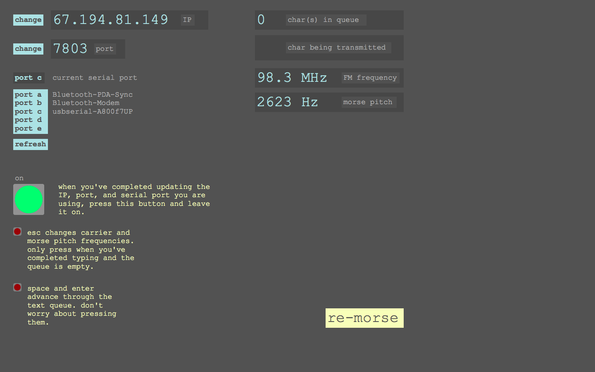

# Re-Morse, for 4 typists and 4 radios

Code repository for the piece _Re-Morse_, composed and performed by the University of Michigan's Electronic Chamber Music Ensemble, 23 March 2013.

## Program Notes

A brand new collective composition that emerged from a rhizome planted by Andrew Goulston, _Re-Morse_ is a product of the Electronic Chamber Music group's intensive study of radio this semester; radio as a technology, a medium, an institution, a natural phenomenon, a historical relic. This is a piece of juxtapositions and contradictions. Modern laptop computers organized on a wireless data network drive FM radio transmitters, which in turn broadcast one of the earliest wireless signaling technologies – Morse Code. The receiving performers simultaneously translate the FM frequency space and the audible frequency space into physical space

## Electronic Chamber Music

Electronic Chamber Music is a Performing Arts Technology course devoted to performing music for small ensembles using electronics, computers and acoustic instruments. They perform pieces from the ever-growing repertoire, as well as new works composed by students or collectively devised by the group. The course focuses intensely on a different theme or composer each year, culminating in a performance in the spring. This year's theme is radio.

Will add more info about the technical workings of the piece as well as a schematic and parts list for the transmitters.